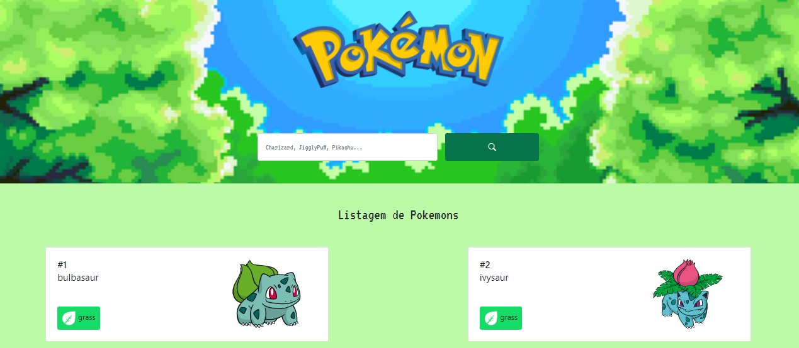

#  Pokedex

> Projeto criado com objetivo de consumir a pokeApi fazendo uma listagem dos pokemons e utilizando bootstrap e javascript.

### Ajustes e melhorias

O projeto ainda está em desenvolvimento e as próximas atualizações serão voltadas nas seguintes tarefas:

- [x] Trazer dados da Api
- [x] Filtrar as informações
- [x] Trazer os dados dinâmicamente
- [ ] Fazer a paginação da lista
- [ ] Tornar possível a busca de pokemons

[⬆ Voltar ao topo](#pokedex) 
